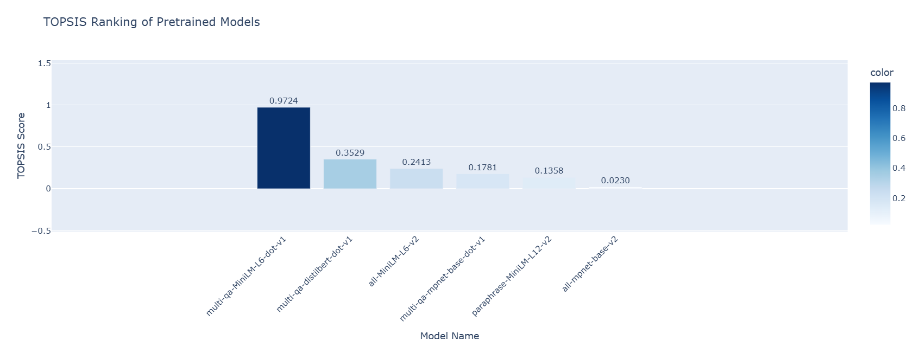

# TOPSIS-Based Pretrained Model Selection

## Overview
This project applies the **TOPSIS** method to compare different pretrained models for text sentence similarity tasks. The ranking helps in selecting the best model based on:
- **Sentence Embedding Performance**
- **Semantic Search Performance**
- **Inference Speed**

The final rankings are visualized using an interactive **Plotly Express** bar chart.

## Methods Used
- **TOPSIS** for multi-criteria decision making
- **Normalization of Decision Matrix** to standardize data
- **Weighted Score Calculation** to balance different parameters
- **Distance Computation** from ideal and worst-case solutions
- **Plotly Express Visualization** for interactive ranking display

## Steps
1. Define the models and their evaluation criteria.
2. Normalize the data to ensure fair comparison.
3. Apply weights to balance different factors.
4. Calculate ideal and worst-case solutions.
5. Compute distances and derive TOPSIS scores.
6. Rank models based on their scores.
7. Display an interactive bar chart for easy comparison.

## Documentation Reference
For more details on TOPSIS and model selection methodologies, refer to the official documentation:
- [TOPSIS Documentation](https://en.wikipedia.org/wiki/TOPSIS)
- [Sentence Similarity Documentation](https://www.sbert.net/docs/usage/semantic_textual_similarity.html)

## Example Graph
Below is an example of the generated **TOPSIS ranking graph**:

## Best Model
The script automatically highlights the best model based on the highest TOPSIS score.

## Contact
For any questions or improvements, feel free to contribute!
